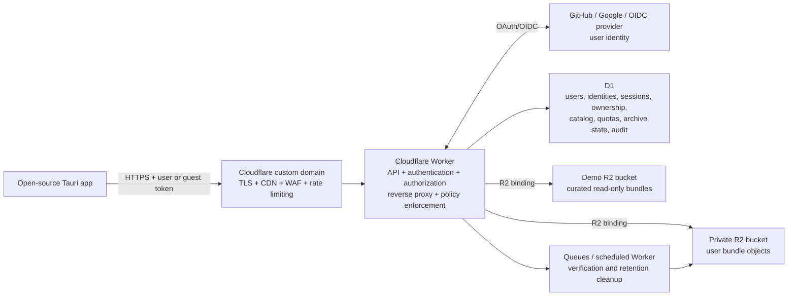
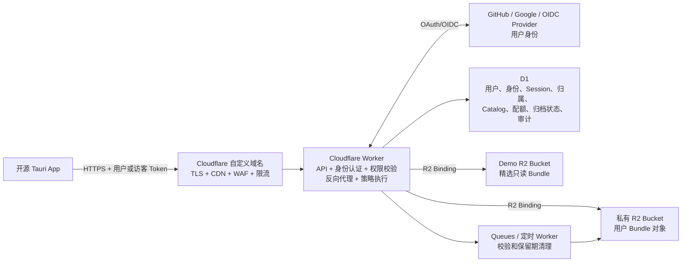

# Managed Cloud Architecture: Cloudflare R2, CDN, and a Worker Reverse Proxy

Status: Proposal
Project: Agent Sync
Last updated: 2026-07-19

## English

### 1. Decision

This design is feasible and fits Agent Sync well.

The recommended managed service is a private Cloudflare R2 bucket behind a Cloudflare Worker on a custom domain. The Worker is both the public API and the reverse proxy/policy boundary. The open-source desktop app never receives the managed bucket credentials and never calls the managed R2 bucket directly.

The desktop app should continue supporting local folders and user-owned S3/R2 storage. The official managed cloud is a separate provider and is configured as the default endpoint for new installations.

The default configuration may contain this public endpoint:

```text
https://api.agentsync.example.com
```

It must not contain a shared bearer token, R2 access key, or R2 secret key. A secret shipped in an open-source client is public.

### 2. Recommended topology



For the first release, the Worker can serve all ordinary object reads and writes through an R2 binding. This is the simplest private design and requires no S3 credential inside the Worker.

If very large uploads later become a bottleneck, use a hybrid flow: the Worker authenticates and authorizes the upload, generates a short-lived presigned PUT URL for one immutable object, and finalizes the bundle head through the Worker. Cloudflare documents this direct-upload pattern for user-generated content. Presigned R2 URLs use the R2 S3 API hostname and do not work with a custom domain, so this should be an optimization rather than the core API contract.

#### VM requirement

No VM or traditional host is required for this design. The Worker is the API server and reverse proxy; R2 stores objects; D1 stores application metadata and sessions; Queues and scheduled Workers handle background verification and retention cleanup; Cloudflare's edge supplies TLS, CDN, WAF, and rate limiting.

A VM should be introduced only if a measured requirement cannot fit the Workers model—for example, a long-running native binary, heavy archive or malware scanning, a persistent process, or another workload exceeding Worker execution or request limits. Large object transfer alone is not a reason to add a VM; use an authorized presigned upload path if needed.

### 3. Why the Worker should be the reverse proxy

The Worker provides a narrow application API instead of exposing an S3-compatible API to managed-cloud users. It must:

- authenticate the user or read-only demo guest;
- derive the tenant and R2 key prefix on the server;
- verify bundle ownership on every request;
- validate object type, size, hash, and allowed path;
- enforce quotas and rate limits;
- implement immutable writes and compare-and-swap updates;
- omit a generic delete operation;
- emit audit events; and
- return safe cache headers.

The server must assume the open-source client is untrusted. Obscure bundle IDs, CORS, and UI restrictions are not authorization controls.

Cloudflare Workers can access R2 through an R2 binding. This keeps the managed bucket private and avoids storing R2 access keys in the desktop app. A Worker custom domain also gives the API a stable production hostname with Cloudflare-managed DNS and TLS.

### 4. CDN and caching policy

Cloudflare CDN remains useful even when the Worker is the origin, but not every response should be cached.

| Data | CDN policy | Reason |
|---|---|---|
| Public demo immutable files | Cache for a long time, preferably with content-addressed URLs | Same bytes for every user; ideal for edge caching |
| Public demo manifests and commits | Cache when immutable | Safe after publication |
| Demo catalog | Short TTL, such as 60–300 seconds | It changes occasionally |
| `_head.json` or equivalent current pointer | `no-store` | Mutable and used for compare-and-swap correctness |
| Authenticated user metadata | `private, no-store` | Prevent cross-user disclosure |
| Authenticated user bundle content | Do not put in shared CDN cache for the MVP | Authorization mistakes in a shared cache can leak private data |
| API errors and authentication responses | `no-store` | User-specific and potentially sensitive |

Attach a custom domain or route to the Worker before relying on the Workers Cache API. Cloudflare notes that Cache API writes from `workers.dev` previews do not have production cache behavior.

Recommended hostnames:

```text
api.agentsync.example.com       -> Worker API and private bundle gateway
demo.agentsync.example.com      -> same Worker, read-only demo routes with CDN caching
```

Both hostnames can point to the same Worker initially. Keeping a separate demo hostname makes cache rules and security review easier.

Do not attach the private user-data bucket directly to a public R2 custom domain. Doing so makes that bucket publicly addressable. If maximum direct-CDN performance is desired later, only a separate, intentionally public demo bucket should use a direct R2 custom domain.

### 5. Storage model and compatibility with the current app

Agent Sync schema 3 already has a suitable remote layout:

```text
.mallard/
|-- _storage.json
`-- v1/repositories/<bundle-id>/
    |-- _tag.json
    |-- _head.json
    |-- _manifests/<generation>-<commit-id>.json
    |-- _commits/<generation>-<commit-id>.json
    `-- _uploads/<upload-id>/files/<logical-path>
```

The managed service should preserve these logical semantics:

- manifests, commits, and uploaded file objects are immutable;
- `_head.json` is the only authoritative mutable pointer;
- updating the head requires compare-and-swap using the previous ETag/version;
- a failed comparison returns `409 Conflict` rather than overwriting another machine's update; and
- listing is limited to bundles visible to the authenticated tenant.

The managed service does not need to expose the physical R2 key. The Worker can map a logical bundle key to an internal tenant-scoped key such as:

```text
tenants/<tenant-id>/.mallard/v1/repositories/<bundle-id>/...
```

The tenant prefix must always be generated by the Worker, never accepted from the client.

For stronger deletion protection, immutable objects and mutable heads may be placed in separate R2 buckets or prefixes. R2 bucket locks prevent both deletion and overwrite, so a lock must not cover the mutable `_head.json` objects. One safe physical split is:

```text
agent-sync-private-immutable   # manifests, commits, uploads; optional retention lock
agent-sync-private-mutable     # heads and tags; conditional writes, no retention lock
agent-sync-demo               # curated read-only demo bundles
```

### 6. Desktop provider model

Do not disguise the official service as a normal S3 provider. Add an explicit managed provider:

```text
local       -> existing local-folder store
s3         -> existing BYO S3/R2 store
managed    -> official HTTPS API backed by the Worker and R2
```

In the Rust backend, add a `ManagedBundleObjectStore` that implements the same object-store contract already used by the schema-3 bundle engine:

```text
get
put_immutable
compare_and_swap
list
```

There should be no general `delete` method. The managed adapter calls the Worker API, while the existing `S3BundleObjectStore` continues to call a user's own S3/R2 endpoint directly.

The managed storage configuration should contain only non-secret settings, for example:

```json
{
  "kind": "managed",
  "name": "Agent Sync Cloud",
  "base_url": "https://api.agentsync.example.com",
  "account_id": "local-account-reference"
}
```

Access and refresh tokens should live in the operating-system keychain, not in `sync_config.json`. Managed HTTP calls and token handling should run in the Tauri Rust backend rather than in the WebView.

### 7. API surface

The exact routes may change, but the public surface should remain narrow and versioned.

| Method and route | Purpose | Important controls |
|---|---|---|
| `POST /v1/auth/guest` | Create a limited demo session | Read-only by default, short expiry, rate limit |
| `GET /v1/auth/start` | Begin OAuth/OIDC login | PKCE challenge, random state, allowlisted app callback |
| `GET /v1/auth/callback` | Receive the provider callback | Fixed registered callback, state/nonce verification, provider code exchange |
| `POST /v1/auth/exchange` | Exchange the one-time app code | PKCE verifier, single use, very short expiry |
| `POST /v1/auth/refresh` | Rotate an application session | Hashed refresh-token lookup, replay detection, rotation |
| `POST /v1/auth/logout` | Revoke the current refresh session | Authenticated, idempotent, audit event |
| `GET /v1/demo/repos` | List curated demo repositories | Public/read-only, short CDN TTL |
| `GET /v1/demo/repos/{id}/objects/{path}` | Read a demo object | Server-generated mapping, immutable objects cached |
| `GET /v1/bundles` | List bundles owned by the caller | Tenant filter, cursor pagination |
| `POST /v1/bundles` | Allocate a bundle ID | Quota and idempotency key |
| `GET /v1/bundles/{id}/objects/{path}` | Read an authorized bundle object | Ownership check, range support, no shared cache |
| `PUT /v1/bundles/{id}/immutable/{path}` | Create an immutable object | `If-None-Match: *`, length and SHA-256 validation |
| `PUT /v1/bundles/{id}/head` | Publish a new current head | `If-Match` or `If-None-Match`, return `409` on conflict |
| `GET /v1/bundles/{id}/objects` | List allowed bundle objects | Fixed bundle scope, cursor and maximum page size |
| `POST /v1/bundles/{id}/archive` | Hide a bundle and begin retention | No immediate object deletion |
| `POST /v1/bundles/{id}/restore` | Undo archive during retention | Ownership and retention checks |

Avoid a route such as `DELETE /v1/objects/{arbitrary-key}` and avoid accepting raw bucket names or tenant prefixes.

### 8. Request flows

#### User OAuth and application sessions

Cloudflare hosts the application side of authentication, so OAuth does not add a VM. Cloudflare is not the public user's identity provider in the recommended design: GitHub, Google, or another OIDC provider authenticates the person, while the Worker acts as the OAuth broker and issues Agent Sync application sessions. GitHub is the simplest first provider for a developer-focused product; Google or another OIDC provider can be added later.

The Tauri app is a public native client and cannot keep a client secret. Use the Authorization Code flow with PKCE and the user's system browser, not an embedded WebView. For desktop callbacks, prefer a temporary loopback listener bound only to `127.0.0.1` on a random port; a registered application deep link is an alternative for packaged clients.

```text
Tauri Rust backend
  1. generate state + PKCE verifier/challenge
  2. listen on 127.0.0.1:<random-port>
  3. open the system browser at /v1/auth/start
        -> Worker -> GitHub/Google authorization page
        -> provider -> fixed Worker /v1/auth/callback
        -> Worker -> loopback callback with one-time app code
  4. POST one-time code + PKCE verifier to /v1/auth/exchange
  5. receive Agent Sync access token + rotating refresh token
```

The Worker should perform the following steps:

1. Accept the PKCE challenge and an allowlisted loopback/deep-link callback, create a random provider `state`, and store a short-lived login transaction in D1.
2. Redirect the system browser to the provider.
3. On the fixed Worker callback, verify `state` and OIDC `nonce` when applicable, then exchange the provider code using an OAuth client secret stored in Cloudflare Worker Secrets.
4. Upsert the identity by `(issuer, provider_subject)`. Never link accounts using email alone because email addresses can change or be represented differently by providers.
5. Create a single-use app code bound to the PKCE challenge and redirect the browser to the local app callback. Do not put provider tokens or Agent Sync bearer tokens in the redirect URL.
6. Accept the app code and PKCE verifier at `/v1/auth/exchange`, mark the code consumed, and issue an Agent Sync access token plus refresh token.

Recommended session rules:

- access tokens are audience-restricted, scope-restricted, and short-lived, approximately 10–15 minutes;
- refresh tokens are random opaque values, stored only in the OS keychain on the client and stored only as hashes in D1;
- every refresh rotates the token, and replay of an old token revokes that session family;
- D1 contains `users`, `identities`, `oauth_transactions`, and `refresh_sessions`, with expiry and revocation timestamps;
- the provider access token stays inside the Worker and should be discarded after identity lookup when no later provider API access is required;
- API authorization uses the Worker-issued Agent Sync token, not the GitHub or Google access token; and
- logout revokes the refresh session; access tokens expire naturally after their short TTL.

Use separate authentication modes for separate audiences:

| Audience | Recommended authentication |
|---|---|
| Public Agent Sync users | GitHub/Google/OIDC through the Worker, followed by Agent Sync tokens |
| Anonymous demo users | Short-lived `demo:read` guest token; no upload or archive scope |
| Judges needing write access | Expiring account/tenant with a small quota and restricted scopes |
| Administrators and internal tools | Cloudflare Access in front of dedicated admin routes |

Cloudflare Access is useful for administrators, internal tools, and a controlled judging environment. It can place a signed Access JWT on authenticated requests and now also supports Managed OAuth for protected resources. It is not the preferred public desktop-user account system because its normal HTTP-application flow is browser-cookie centered and public product lifecycle requirements—account linking, refresh-token rotation, quotas, deletion, and support—still belong to Agent Sync. If Access protects an admin origin, the Worker must validate the JWT signature, issuer, audience, and expiry rather than trusting the presence of a header.

#### Google OAuth as a provider

Google supports OpenID Connect, Authorization Code, PKCE, and loopback redirects for desktop applications. For the recommended Worker-broker architecture, create a **Web application** OAuth client in Google Cloud and register one exact callback:

```text
https://api.agentsync.example.com/v1/auth/google/callback
```

Google requires the redirect URI to match the registered URI exactly. The Worker receives that fixed callback, performs the Google code exchange using `GOOGLE_CLIENT_SECRET` in Worker Secrets, then redirects a single-use Agent Sync code to the app's allowlisted loopback callback. The dynamic loopback callback is therefore not a Google redirect URI.

Request identity-only scopes unless the product has a concrete Google API feature:

```text
openid email profile
```

Validate the Google ID token signature and its `iss`, `aud`, `exp`, and `nonce` claims. Use the immutable Google `sub` claim as the identity key; do not use email as the user identifier. Do not request Drive, Calendar, or other sensitive scopes merely for sign-in.

For a judge-only demo, keep the Google consent screen in Testing and add the judges as test users. Google currently limits an External app in Testing to 100 listed test users. Before public launch, publish the consent screen and prepare the required homepage, privacy policy, branding, and any verification. Basic identity scopes avoid the heavier verification associated with sensitive or restricted Google APIs, though public branding can still require review.

#### Email/password decision

Email/password changes the recommendation. Do not implement password storage or reset flows in a Worker/D1 application. Password authentication also needs secure password hashing, email verification, reset/recovery, leaked-password protection, rate limits, MFA, session revocation, and careful account-linking behavior.

| Requirement | Recommended approach | Trade-off |
|---|---|---|
| GitHub/Google-only public login | Direct OAuth/OIDC through the Worker | No additional auth service |
| Public email/password plus social login | Supabase Auth | Adds a managed authentication service and its managed Postgres, while D1 remains the Agent Sync application database |
| Public email/password with a richer identity UI and MFA features | Clerk | Adds a managed identity dependency and desktop-flow integration work |
| Internal users or a small judge allowlist by email | Cloudflare Access One-time PIN | Good for controlled access; not a public account system |
| Cloudflare-only public product | Prefer GitHub/Google OAuth or a passwordless design | Cloudflare Access OTP should not be opened to all email addresses |

If email/password becomes a product requirement, Supabase Auth is a reasonable fit: it supports password sign-up/sign-in, email confirmation, password reset, social providers, and JWTs. The Worker validates the Supabase JWT/JWKS and maps the stable Supabase `sub` to the local D1 user and R2 tenant. Passwords and password-reset tokens never pass through Agent Sync's Worker.

Cloudflare Access can email a one-time PIN to approved addresses, which is useful for internal administrators or judges. It is not the recommended public signup flow: Cloudflare explicitly warns that an Access policy allowing all valid email-login methods can grant access to anyone with an email address. Do not build a public email/password system by storing password hashes in D1.

#### Read a public demo repository

1. The app calls the demo catalog without a permanent embedded credential.
2. The Worker returns approved demo bundle metadata.
3. The app requests an immutable demo object through the demo hostname.
4. Cloudflare checks the CDN cache.
5. On a miss, the Worker reads the object through the demo R2 binding and places the safe response in cache.

#### Push a private bundle

1. The app signs in using a browser-based OAuth/OIDC flow with PKCE, or obtains a tightly limited judge session.
2. The Rust backend sends the access token to the Worker.
3. The Worker verifies identity, ownership, quota, object size, and the logical path.
4. Immutable objects are written with create-only semantics.
5. The app submits the new manifest and commit.
6. The app conditionally updates the head using the previously observed ETag/version.
7. The Worker records the action and returns the new version.

#### Archive and delete

1. A user archive request changes database state immediately but does not delete R2 objects.
2. The bundle remains recoverable for a defined period, for example 30 days.
3. A scheduled Worker or Queue consumer deletes eligible objects after retention.
4. Permanent deletion remains available to the data owner for privacy compliance, but is deliberate, audited, and delayed.

### 9. Demo repository design

Preloaded repositories should be a separate read-only catalog, not ordinary user-owned bundles.

- Seed them through an admin or CI publishing tool, never through a secret embedded in the app.
- Scan every demo for credentials, personal conversations, absolute machine paths, and private source code.
- Confirm that all included code and content may legally be redistributed.
- Give each release an immutable version so judging remains reproducible.
- Let users choose **Import demo** to copy the selected bundle into their own namespace.
- If judges need write access, create a small temporary tenant with a strict quota and automatic expiry.

### 10. Security requirements

- Keep every managed R2 bucket private by default.
- Give the Worker access through bucket bindings with the least required permissions.
- Never put managed R2 credentials or an administrative API token in the desktop application.
- Authenticate every private request and authorize every bundle independently.
- Reject traversal, encoded traversal, control characters, oversized keys, and unknown logical roots.
- Enforce maximum object, request, bundle, and tenant sizes on the server.
- Verify SHA-256 before accepting a completed object or manifest.
- Use create-only writes for immutable objects and conditional writes for the head.
- Use short-lived access tokens and rotate refresh tokens.
- Require OAuth `state`, PKCE, exact provider callback matching, and OIDC `nonce` where applicable.
- Restrict native-app callbacks to loopback IP literals or registered application links; never implement an arbitrary redirect endpoint.
- Keep OAuth client secrets and session-signing material in Worker Secrets or Secrets Store bindings, never plaintext `vars`.
- Store only hashes of refresh tokens and one-time app codes in D1, and make every code single-use.
- Store desktop credentials in the OS keychain.
- Add per-user and per-IP rate limits, abuse controls, structured audit logs, and alerts.
- Return generic external errors and keep internal R2 keys and stack traces out of responses.
- Configure explicit CORS origins only if the WebView talks to the API directly. Prefer Rust-backend HTTP calls, which do not depend on browser CORS.

R2 encrypts objects at rest, but that does not prevent the service operator from reading plaintext. Because Agent Sync may carry conversations and configuration, client-side encryption should be added for private payloads. The server should retain only the minimum searchable metadata needed for ownership, quotas, and the demo catalog. Known credentials must remain excluded before encryption and upload.

### 11. Recommended Cloudflare resources

Minimum MVP:

- one Cloudflare Worker on a custom domain;
- one private R2 bucket for user data;
- one separate R2 bucket or prefix for demos;
- D1 for users, identities, OAuth transactions, refresh sessions, ownership, catalog, quotas, archive state, and audit indexes;
- Worker Secrets or Secrets Store bindings for OAuth provider secrets and signing keys;
- a registered GitHub OAuth application or OIDC provider; and
- Cloudflare rate limiting/WAF rules.

Recommended production additions:

- a second R2 bucket separating immutable content from mutable heads;
- R2 bucket-lock rules for immutable data only;
- Queues for post-upload verification and deletion jobs;
- scheduled Workers for retention cleanup;
- Turnstile or equivalent abuse protection for anonymous guest creation; and
- monitoring for authentication failures, quota abuse, CAS conflicts, and R2 errors.

### 12. MVP delivery order

1. Deploy a private R2 bucket and a Worker with R2 binding on a custom domain.
2. Add the read-only demo catalog and pre-seed two or three safe bundles.
3. Add `managed` and `ManagedBundleObjectStore` to the desktop app.
4. Make the managed endpoint the default storage suggestion, without embedding credentials.
5. Add GitHub OAuth through the Worker using system-browser PKCE, rotating sessions, tenant ownership, quota enforcement, and private push/pull.
6. Add archive/restore and delayed permanent deletion.
7. Add client-side encryption.
8. Add the optional direct-presigned upload path only if measurements justify it.

### 13. Acceptance criteria

- A fresh installation can browse and import demo repositories without setup.
- The app contains no managed R2 access key, secret key, or shared permanent token.
- The app contains no OAuth client secret and completes login through the system browser with PKCE.
- OAuth callbacks reject invalid/replayed `state`, invalid PKCE verifiers, reused app codes, and unapproved redirect targets.
- Refresh tokens are stored in the OS keychain, hashed in D1, rotated on use, and revoked on replay or logout.
- Direct unauthenticated access to the private bucket fails.
- A user cannot read, list, overwrite, archive, or restore another tenant's bundle.
- Immutable object overwrite attempts fail.
- Concurrent head updates produce one success and one `409 Conflict`, not lost data.
- The public demo route shows CDN cache hits after the first request.
- Private responses are absent from the shared CDN cache.
- Archive is reversible during retention; permanent deletion is delayed and audited.
- Existing local-folder and BYO S3/R2 providers continue to work.

### 14. Official references

- [Use R2 from Workers](https://developers.cloudflare.com/r2/api/workers/workers-api-usage/)
- [Workers custom domains](https://developers.cloudflare.com/workers/configuration/routing/custom-domains/)
- [Use the Cache API with R2](https://developers.cloudflare.com/r2/examples/cache-api/)
- [Enable Cloudflare cache for R2](https://developers.cloudflare.com/cache/interaction-cloudflare-products/r2/)
- [R2 presigned URLs](https://developers.cloudflare.com/r2/api/s3/presigned-urls/)
- [R2 CORS configuration](https://developers.cloudflare.com/r2/buckets/cors/)
- [R2 conditional operations](https://developers.cloudflare.com/r2/api/workers/workers-api-reference/)
- [R2 bucket locks](https://developers.cloudflare.com/r2/buckets/bucket-locks/)
- [R2 data security](https://developers.cloudflare.com/r2/reference/data-security/)
- [Cloudflare reference architecture for user-generated content](https://developers.cloudflare.com/reference-architecture/diagrams/storage/storing-user-generated-content/)
- [Cloudflare Worker Secrets](https://developers.cloudflare.com/workers/configuration/secrets/)
- [Cloudflare Access application tokens](https://developers.cloudflare.com/cloudflare-one/access-controls/applications/http-apps/authorization-cookie/application-token/)
- [Cloudflare Access authentication for coding agents and Managed OAuth](https://developers.cloudflare.com/cloudflare-one/access-controls/authenticate-agents/)
- [RFC 8252: OAuth 2.0 for Native Apps](https://www.rfc-editor.org/rfc/rfc8252)
- [Google OAuth for iOS and desktop apps](https://developers.google.com/identity/protocols/oauth2/native-app)
- [Google OpenID Connect](https://developers.google.com/identity/openid-connect/openid-connect)
- [Google OpenID Connect API reference (`sub` as the stable user identifier)](https://developers.google.com/identity/openid-connect/reference)
- [Google OAuth consent-screen publication and test-user limits](https://support.google.com/cloud/answer/13461325)
- [Supabase password authentication](https://supabase.com/docs/guides/auth/passwords)
- [Supabase password security](https://supabase.com/docs/guides/auth/password-security)
- [Clerk custom email/password authentication](https://clerk.com/docs/guides/development/custom-flows/authentication/email-password)
- [Cloudflare Access One-time PIN login](https://developers.cloudflare.com/cloudflare-one/integrations/identity-providers/one-time-pin/)

---

## 中文

### 1. 架构结论

这个方案可行，而且很适合 Agent Sync。

建议把官方托管服务设计成：私有 Cloudflare R2 Bucket 放在 Cloudflare Worker 后面，Worker 绑定自定义域名，同时承担公开 API、反向代理和权限边界。开源桌面 App 永远拿不到官方 Bucket 的凭据，也不直接访问官方 R2 Bucket。

桌面 App 继续支持本地目录以及用户自带的 S3/R2。官方托管云作为一个独立的存储 Provider，并在新安装中提供为默认推荐的服务地址。

默认配置可以包含下面这个公开地址：

```text
https://api.agentsync.example.com
```

但绝不能包含共享 Bearer Token、R2 Access Key 或 R2 Secret Key。任何打包进开源客户端的秘密实际上都是公开信息。

### 2. 推荐拓扑



第一版可以让 Worker 通过 R2 Binding 代理所有普通对象的读取和写入。这个方案最简单、Bucket 保持私有，而且 Worker 内也不需要保存 S3 Access Key。

如果未来超大文件上传成为瓶颈，可以升级为混合流程：Worker 先认证用户、校验权限，再为单个不可变对象生成短时有效的 presigned PUT URL，最后仍通过 Worker 提交 Bundle Head。Cloudflare 官方也推荐用这种方式处理大体积用户上传。需要注意，R2 presigned URL 只能使用 R2 的 S3 API 域名，不能使用自定义域名，因此它应该是后续性能优化，而不是核心 API 契约。

#### 是否需要 VM

这个方案不需要 VM 或传统主机。Worker 就是 API Server 和反向代理；R2 保存对象；D1 保存应用元数据和 Session；Queues 与定时 Worker 处理后台校验和保留期清理；Cloudflare Edge 提供 TLS、CDN、WAF 和限流。

只有经过测量确认某项需求无法适应 Workers 模型时才应增加 VM，例如必须运行长时间的 Native Binary、重型压缩包或恶意软件扫描、常驻进程，或者超过 Worker 执行及请求限制的任务。大文件传输本身不是增加 VM 的理由；需要时使用经过 Worker 授权的 Presigned Upload 即可。

### 3. 为什么用 Worker 做反向代理

Worker 对外提供的是收敛后的业务 API，而不是把一个完整的 S3 兼容 API 暴露给官方云用户。它必须负责：

- 认证正式用户或只读 Demo 访客；
- 在服务端推导租户和 R2 Key 前缀；
- 每次请求都校验 Bundle 归属；
- 校验对象类型、大小、哈希和允许的逻辑路径；
- 执行配额和限流；
- 实现不可变写入以及 Compare-and-Swap 更新；
- 不提供通用删除接口；
- 生成审计事件；
- 返回安全的缓存响应头。

服务端必须把开源客户端视为不可信客户端。难猜的 Bundle ID、CORS 以及 UI 上隐藏按钮都不能代替服务端授权。

Cloudflare Worker 可以通过 R2 Binding 直接访问 Bucket。这样官方 Bucket 可以保持私有，也不需要把 R2 Access Key 放进桌面 App。Worker 自定义域名还能提供稳定的生产地址，并由 Cloudflare 管理 DNS 和 TLS。

### 4. CDN 与缓存策略

即使 Worker 是源站，Cloudflare CDN 仍然有价值，但不能缓存所有响应。

| 数据 | CDN 策略 | 原因 |
|---|---|---|
| 公共 Demo 的不可变文件 | 长时间缓存，最好使用内容寻址 URL | 所有用户拿到相同字节，非常适合边缘缓存 |
| 公共 Demo 的 Manifest 和 Commit | 确认不可变后缓存 | 发布后内容不会变化 |
| Demo Catalog | 短 TTL，例如 60–300 秒 | 偶尔需要更新 |
| `_head.json` 或等价的当前指针 | `no-store` | 内容可变，而且关系到 CAS 正确性 |
| 已认证用户的元数据 | `private, no-store` | 防止跨用户泄露 |
| 已认证用户的 Bundle 内容 | MVP 阶段不进入共享 CDN 缓存 | 共享缓存 Key 配置错误可能泄露私有数据 |
| API 错误和认证响应 | `no-store` | 与用户相关，且可能包含敏感信息 |

在依赖 Workers Cache API 之前，必须给 Worker 绑定自定义域名或 Route。Cloudflare 文档明确说明，`workers.dev` 预览环境中的 Cache API 写入不具备正式生产缓存效果。

推荐域名：

```text
api.agentsync.example.com       -> Worker API 与私有 Bundle 网关
demo.agentsync.example.com      -> 同一个 Worker，提供可被 CDN 缓存的只读 Demo 路由
```

第一版两个域名可以指向同一个 Worker。把 Demo 单独放在一个域名上，会让缓存规则和安全审查更清晰。

不要把存放用户私有数据的 R2 Bucket 直接绑定到公开的 R2 自定义域名，否则该 Bucket 会变成可公开寻址。如果未来确实需要最高的直连 CDN 性能，只允许一个独立、明确公开的 Demo Bucket 使用 R2 直连自定义域名。

### 5. 存储模型及与当前 App 的兼容方式

Agent Sync schema 3 已经有适合这个服务的远端布局：

```text
.mallard/
|-- _storage.json
`-- v1/repositories/<bundle-id>/
    |-- _tag.json
    |-- _head.json
    |-- _manifests/<generation>-<commit-id>.json
    |-- _commits/<generation>-<commit-id>.json
    `-- _uploads/<upload-id>/files/<logical-path>
```

官方托管服务应保持现有逻辑语义：

- Manifest、Commit 和上传文件对象不可变；
- `_head.json` 是唯一权威的可变指针；
- 更新 Head 时必须携带上一次读取到的 ETag/版本并执行 CAS；
- 比较失败返回 `409 Conflict`，不能覆盖另一台机器刚刚提交的更新；
- List 只能返回当前已认证租户可见的 Bundle。

托管服务不需要把实际 R2 Key 暴露给客户端。Worker 可以把逻辑 Bundle Key 映射为内部租户路径，例如：

```text
tenants/<tenant-id>/.mallard/v1/repositories/<bundle-id>/...
```

租户前缀必须始终由 Worker 生成，不能从客户端参数中直接接收。

如果需要更强的防删除保护，可以把不可变对象和可变 Head 放进不同的 R2 Bucket 或物理前缀。R2 Bucket Lock 会同时禁止删除和覆盖，所以不能让锁规则覆盖可变的 `_head.json`。一种安全的拆分方式是：

```text
agent-sync-private-immutable   # manifests、commits、uploads；可配置保留锁
agent-sync-private-mutable     # heads 和 tags；使用条件写，不配置保留锁
agent-sync-demo               # 精选只读 Demo Bundle
```

### 6. 桌面端 Provider 模型

不要把官方服务伪装成普通 S3 Provider。应该新增一个明确的官方托管 Provider：

```text
local       -> 现有本地目录 Store
s3         -> 现有 BYO S3/R2 Store
managed    -> 由 Worker + R2 支撑的官方 HTTPS API
```

在 Rust 后端新增 `ManagedBundleObjectStore`，实现 schema-3 Bundle Engine 已经使用的同一组对象存储契约：

```text
get
put_immutable
compare_and_swap
list
```

不增加通用 `delete` 方法。Managed Adapter 调用 Worker API，已有 `S3BundleObjectStore` 则继续直接调用用户自己的 S3/R2 Endpoint。

Managed Storage 配置只保存非敏感字段，例如：

```json
{
  "kind": "managed",
  "name": "Agent Sync Cloud",
  "base_url": "https://api.agentsync.example.com",
  "account_id": "local-account-reference"
}
```

Access Token 和 Refresh Token 应保存在操作系统钥匙串中，而不是 `sync_config.json`。Managed HTTP 请求以及 Token 管理应放在 Tauri Rust 后端，不放在 WebView 前端。

### 7. API 范围

具体路由可以调整，但对外 API 应保持收敛并带版本号。

| 方法与路由 | 用途 | 关键限制 |
|---|---|---|
| `POST /v1/auth/guest` | 创建受限 Demo Session | 默认只读、短有效期、限流 |
| `GET /v1/auth/start` | 开始 OAuth/OIDC 登录 | PKCE Challenge、随机 State、允许的 App Callback |
| `GET /v1/auth/callback` | 接收 Provider Callback | 固定注册 Callback、State/Nonce 校验、Provider Code Exchange |
| `POST /v1/auth/exchange` | 交换一次性 App Code | PKCE Verifier、仅使用一次、极短有效期 |
| `POST /v1/auth/refresh` | 轮换应用 Session | Refresh Token 哈希查询、重放检测、Token Rotation |
| `POST /v1/auth/logout` | 撤销当前 Refresh Session | 已认证、幂等、审计事件 |
| `GET /v1/demo/repos` | 列出精选 Demo Repo | 公开只读、较短 CDN TTL |
| `GET /v1/demo/repos/{id}/objects/{path}` | 读取 Demo 对象 | 服务端映射路径，不可变对象可缓存 |
| `GET /v1/bundles` | 列出调用者拥有的 Bundle | 租户过滤、游标分页 |
| `POST /v1/bundles` | 分配 Bundle ID | 配额、Idempotency Key |
| `GET /v1/bundles/{id}/objects/{path}` | 读取有权限的 Bundle 对象 | 归属校验、Range 支持、禁止共享缓存 |
| `PUT /v1/bundles/{id}/immutable/{path}` | 创建不可变对象 | `If-None-Match: *`、长度及 SHA-256 校验 |
| `PUT /v1/bundles/{id}/head` | 发布新的当前 Head | `If-Match` 或 `If-None-Match`；冲突返回 `409` |
| `GET /v1/bundles/{id}/objects` | 列出允许访问的 Bundle 对象 | 固定 Bundle 范围、游标和最大页大小 |
| `POST /v1/bundles/{id}/archive` | 隐藏 Bundle 并开始保留期 | 不立即删除对象 |
| `POST /v1/bundles/{id}/restore` | 在保留期内撤销归档 | 归属和保留期校验 |

不要提供类似 `DELETE /v1/objects/{arbitrary-key}` 的路由，也不要接受任意 Bucket 名称或租户前缀。

### 8. 请求流程

#### 用户 OAuth 与应用 Session

Cloudflare 托管认证流程的应用侧，因此 OAuth 不会带来 VM 需求。在推荐设计中，Cloudflare 不是公众用户的 Identity Provider：GitHub、Google 或其他 OIDC Provider 负责确认用户身份，Worker 作为 OAuth Broker，并签发 Agent Sync 自己的应用 Session。对于面向开发者的产品，第一版使用 GitHub 最简单，之后可以增加 Google 或其他 OIDC Provider。

Tauri App 属于无法保守秘密的 Public Native Client，不能内置 Client Secret。使用 Authorization Code + PKCE，并在用户的系统浏览器中完成登录，不能使用嵌入式 WebView。桌面端 Callback 优先使用仅监听 `127.0.0.1` 随机端口的临时 Loopback Listener；打包后的客户端也可以使用已注册的 App Deep Link。

```text
Tauri Rust 后端
  1. 生成 State + PKCE Verifier/Challenge
  2. 监听 127.0.0.1:<随机端口>
  3. 在系统浏览器打开 /v1/auth/start
        -> Worker -> GitHub/Google 授权页面
        -> Provider -> 固定的 Worker /v1/auth/callback
        -> Worker -> 携带一次性 App Code 的 Loopback Callback
  4. 把一次性 Code + PKCE Verifier POST 到 /v1/auth/exchange
  5. 获得 Agent Sync Access Token + 可轮换 Refresh Token
```

Worker 应执行以下步骤：

1. 接收 PKCE Challenge 和允许的 Loopback/Deep-Link Callback，生成随机 Provider `state`，并在 D1 中保存短有效期 Login Transaction。
2. 把系统浏览器重定向到 OAuth Provider。
3. 在固定 Worker Callback 上校验 `state`，在适用时校验 OIDC `nonce`，再使用保存在 Cloudflare Worker Secrets 中的 OAuth Client Secret 交换 Provider Code。
4. 使用 `(issuer, provider_subject)` 创建或更新身份。不能仅凭 Email 关联账号，因为 Email 可能变化，不同 Provider 的表达方式也可能不同。
5. 生成绑定 PKCE Challenge 的一次性 App Code，然后把浏览器重定向到本地 App Callback。不能把 Provider Token 或 Agent Sync Bearer Token 放进重定向 URL。
6. `/v1/auth/exchange` 接收 App Code 与 PKCE Verifier，将 Code 标记为已消费，并签发 Agent Sync Access Token 和 Refresh Token。

推荐 Session 规则：

- Access Token 必须限制 Audience 和 Scope，并采用约 10–15 分钟的短有效期；
- Refresh Token 是随机 Opaque Value，客户端只把原值保存在系统钥匙串中，D1 只保存哈希；
- 每次 Refresh 都轮换 Token，旧 Token 被重放时撤销整个 Session Family；
- D1 保存带过期和撤销时间的 `users`、`identities`、`oauth_transactions` 与 `refresh_sessions`；
- Provider Access Token 只留在 Worker 内；如果身份查询后不再调用 Provider API，就应丢弃；
- API 授权使用 Worker 签发的 Agent Sync Token，而不是 GitHub 或 Google Access Token；
- Logout 撤销 Refresh Session，短有效期 Access Token 自然过期。

不同受众使用不同认证方式：

| 受众 | 推荐认证方式 |
|---|---|
| Agent Sync 公众用户 | 通过 Worker 完成 GitHub/Google/OIDC，再换取 Agent Sync Token |
| 匿名 Demo 用户 | 短有效期 `demo:read` Guest Token；没有 Upload 或 Archive Scope |
| 需要写权限的评委 | 自动过期、小配额、Scope 受限的账号/租户 |
| 管理员和内部工具 | 在独立 Admin Route 前使用 Cloudflare Access |

Cloudflare Access 适合管理员、内部工具和受控评审环境。它可以在认证后的请求上附带签名 Access JWT，目前也支持面向受保护资源的 Managed OAuth。但不建议把它作为公众桌面用户的主要账号系统：常规 HTTP Application Flow 以浏览器 Cookie 为中心，而账号关联、Refresh Token 轮换、配额、删除和客服支持等公众产品生命周期仍属于 Agent Sync。如果 Admin Origin 使用 Access 保护，Worker 必须校验 JWT Signature、Issuer、Audience 和 Expiry，不能只检查某个 Header 是否存在。

#### 将 Google OAuth 作为 Provider

Google 支持 OpenID Connect、Authorization Code、PKCE，以及桌面应用的 Loopback Redirect。在推荐的 Worker Broker 架构中，应在 Google Cloud 创建 **Web application** OAuth Client，并注册一个精确匹配的 Callback：

```text
https://api.agentsync.example.com/v1/auth/google/callback
```

Google 要求 `redirect_uri` 与已注册 URI 完全匹配。Worker 接收这个固定 Callback，使用保存在 Worker Secrets 中的 `GOOGLE_CLIENT_SECRET` 交换 Google Code，然后把一次性 Agent Sync Code 重定向到 App 允许的 Loopback Callback。因此动态 Loopback Callback 并不是 Google 的 Redirect URI。

除非产品明确需要调用 Google API，否则只请求身份相关 Scope：

```text
openid email profile
```

必须校验 Google ID Token 的 Signature、`iss`、`aud`、`exp` 与 `nonce` Claim。身份主键使用不可变的 Google `sub`，不能使用 Email。仅登录时不要请求 Drive、Calendar 或其他 Sensitive Scope。

评委 Demo 可以把 Google Consent Screen 保持在 Testing，并把评委加入 Test User。Google 目前把处于 Testing 的 External App 限制为最多 100 个已列出的 Test User。公开发布前，应发布 Consent Screen，并准备所需的主页、隐私政策、品牌信息和可能的 Verification。基础身份 Scope 可以避免 Sensitive 或 Restricted Google API 所需的较重审核，但公开品牌信息仍可能需要审核。

#### Email/Password 的决策

一旦支持 Email/Password，推荐方案就改变了。不要在 Worker/D1 应用中自行实现 Password Storage 或 Password Reset。Password 认证还需要安全 Password Hashing、Email Verification、Reset/Recovery、泄露密码检测、限流、MFA、Session Revocation 和严谨的 Account Linking。

| 需求 | 推荐方式 | 代价 |
|---|---|---|
| 只支持 GitHub/Google 的公众登录 | 通过 Worker 直接实现 OAuth/OIDC | 不增加认证服务 |
| 公众 Email/Password 加 Social Login | Supabase Auth | 增加托管认证服务及其托管 Postgres；D1 仍是 Agent Sync 的应用数据库 |
| 公众 Email/Password，且需要更完善的身份 UI 和 MFA 功能 | Clerk | 增加托管身份依赖与桌面流程集成工作 |
| 内部用户或少量评委按 Email 登录 | Cloudflare Access One-time PIN | 适用于受控访问，不是公众账号系统 |
| 必须是 Cloudflare-only 的公众产品 | 优先 GitHub/Google OAuth 或 Passwordless 设计 | 不能把 Access OTP 向所有 Email 地址开放 |

如果 Email/Password 成为产品需求，Supabase Auth 是合理选择：它提供 Password Sign-up/Sign-in、Email Confirmation、Password Reset、Social Provider 和 JWT。Worker 只需验证 Supabase JWT/JWKS，并把稳定的 Supabase `sub` 映射到本地 D1 User 及 R2 Tenant。Password 与 Password Reset Token 永远不经过 Agent Sync Worker。

Cloudflare Access 可以向已批准 Email 发送 One-time PIN，适合内部管理员或评委，但不适合作为公众注册入口：Cloudflare 明确警告，如果 Access Policy 允许所有有效的 Email Login Method，任何拥有 Email 地址的人都可能获得访问权。不要通过在 D1 存 Password Hash 的方式自建公众 Email/Password 系统。

#### 读取公共 Demo Repo

1. App 在没有永久内置凭据的情况下请求 Demo Catalog。
2. Worker 返回通过审核的 Demo Bundle 元数据。
3. App 通过 Demo 域名请求不可变对象。
4. Cloudflare 先检查 CDN 缓存。
5. 缓存未命中时，Worker 通过 Demo R2 Binding 读取对象，并把安全响应写入缓存。

#### Push 私有 Bundle

1. App 使用基于浏览器的 OAuth/OIDC + PKCE 登录，或者获得权限严格受限的评委 Session。
2. Rust 后端把 Access Token 发给 Worker。
3. Worker 校验身份、Bundle 归属、配额、对象大小和逻辑路径。
4. 不可变对象使用仅创建语义写入。
5. App 提交新的 Manifest 和 Commit。
6. App 使用之前看到的 ETag/版本对 Head 执行条件更新。
7. Worker 写入审计记录并返回新版本。

#### 归档与删除

1. 用户发起归档后，数据库状态立即改变，但 R2 对象不会马上删除。
2. Bundle 在定义好的保留期内仍可恢复，例如 30 天。
3. 定时 Worker 或 Queue Consumer 在保留期结束后删除符合条件的对象。
4. 为满足隐私法规，数据所有者最终仍可永久删除自己的数据，但该操作应明确、可审计并延迟执行。

### 9. Demo Repo 设计

预置 Repo 应是一个独立的只读 Catalog，而不是普通用户拥有的 Bundle。

- 通过管理员工具或 CI 发布，不能依赖 App 中内置的秘密。
- 每个 Demo 都要扫描凭据、私人对话、机器绝对路径和私有源码。
- 确认所有代码和内容都允许再分发。
- 每次发布使用不可变版本，保证评委验收可复现。
- 提供 **Import demo**，把选中的 Bundle 复制到用户自己的命名空间。
- 如果评委需要写入权限，为其创建小配额、自动过期的临时租户。

### 10. 安全要求

- 所有官方 R2 Bucket 默认保持私有。
- Worker 通过 Bucket Binding 获得最小必要权限。
- 桌面 App 中绝不保存官方 R2 凭据或管理员 API Token。
- 每个私有请求都必须认证，每个 Bundle 都必须单独授权。
- 拒绝路径穿越、编码后的路径穿越、控制字符、超长 Key 和未知逻辑根目录。
- 服务端限制单对象、单请求、单 Bundle 和单租户的最大体积。
- 在接受完成的对象或 Manifest 前验证 SHA-256。
- 不可变对象使用仅创建写入，Head 使用条件写入。
- 使用短有效期 Access Token，并轮换 Refresh Token。
- OAuth 必须使用 `state`、PKCE、严格匹配 Provider Callback，并在适用时校验 OIDC `nonce`。
- Native App Callback 只能是 Loopback IP Literal 或已注册的 App Link；不能实现任意 Redirect Endpoint。
- OAuth Client Secret 和 Session Signing Material 必须放入 Worker Secrets 或 Secrets Store Binding，不能使用明文 `vars`。
- D1 只保存 Refresh Token 和一次性 App Code 的哈希，而且每个 Code 只能使用一次。
- 桌面凭据保存在操作系统钥匙串。
- 增加按用户和 IP 的限流、滥用保护、结构化审计日志及告警。
- 对外返回通用错误，不在响应中泄露内部 R2 Key 或 Stack Trace。
- 只有 WebView 直接请求 API 时才需要配置明确的 CORS Origin。优先由 Rust 后端发起 HTTP 请求，从而不依赖浏览器 CORS。

R2 会对静态数据自动加密，但这并不能阻止服务运营方读取明文。Agent Sync 可能同步对话和配置，因此私有 Payload 应增加客户端加密。服务端只保留归属、配额和 Demo Catalog 所需的最少可搜索元数据。已知凭据在加密和上传之前仍必须排除。

### 11. 推荐的 Cloudflare 资源

最低可用 MVP：

- 一个绑定自定义域名的 Cloudflare Worker；
- 一个存放用户数据的私有 R2 Bucket；
- 一个独立 Demo R2 Bucket 或 Demo 前缀；
- 使用 D1 保存用户、身份、OAuth Transaction、Refresh Session、归属、Catalog、配额、归档状态和审计索引；
- 使用 Worker Secrets 或 Secrets Store Binding 保存 OAuth Provider Secret 和 Signing Key；
- 注册一个 GitHub OAuth Application 或其他 OIDC Provider；
- Cloudflare 限流和 WAF 规则。

生产环境建议增加：

- 第二个 R2 Bucket，把不可变内容和可变 Head 分开；
- 只对不可变数据设置 R2 Bucket Lock；
- 使用 Queues 处理上传后校验和删除任务；
- 使用定时 Worker 清理过期数据；
- 使用 Turnstile 或等价方案保护匿名访客创建接口；
- 监控认证失败、配额滥用、CAS 冲突和 R2 错误。

### 12. MVP 实施顺序

1. 部署私有 R2 Bucket，以及通过 R2 Binding 访问它并绑定自定义域名的 Worker。
2. 增加只读 Demo Catalog，并预置两到三个安全 Bundle。
3. 在桌面 App 中增加 `managed` 和 `ManagedBundleObjectStore`。
4. 把官方托管 Endpoint 设为默认推荐，但不内置任何凭据。
5. 通过 Worker 增加 GitHub OAuth，采用系统浏览器 PKCE、可轮换 Session、租户归属、配额限制和私有 Push/Pull。
6. 增加归档/恢复以及延迟永久删除。
7. 增加客户端加密。
8. 只有性能测量证明有必要时，才增加可选的 presigned 直传路径。

### 13. 验收标准

- 全新安装无需配置即可浏览和导入 Demo Repo。
- App 中不存在官方 R2 Access Key、Secret Key 或共享永久 Token。
- App 中不存在 OAuth Client Secret，并通过系统浏览器和 PKCE 完成登录。
- OAuth Callback 会拒绝无效或重放的 `state`、错误 PKCE Verifier、已使用的 App Code 和未经允许的 Redirect Target。
- Refresh Token 在客户端保存在系统钥匙串，在 D1 中只保存哈希，每次使用都会轮换，并在重放或 Logout 时撤销。
- 未认证用户无法直接访问私有 Bucket。
- 用户不能读取、列出、覆盖、归档或恢复其他租户的 Bundle。
- 覆盖不可变对象的请求会失败。
- 两个并发 Head 更新只能有一个成功，另一个返回 `409 Conflict`，不会静默丢数据。
- 公共 Demo 路由第一次请求后能够观察到 CDN Cache Hit。
- 私有响应不会进入共享 CDN 缓存。
- 归档在保留期内可以恢复；永久删除延迟执行并留下审计记录。
- 现有本地目录和 BYO S3/R2 Provider 继续工作。

### 14. 官方参考资料

- [在 Workers 中使用 R2](https://developers.cloudflare.com/r2/api/workers/workers-api-usage/)
- [Workers 自定义域名](https://developers.cloudflare.com/workers/configuration/routing/custom-domains/)
- [通过 Cache API 缓存 R2 对象](https://developers.cloudflare.com/r2/examples/cache-api/)
- [为 R2 启用 Cloudflare Cache](https://developers.cloudflare.com/cache/interaction-cloudflare-products/r2/)
- [R2 Presigned URL](https://developers.cloudflare.com/r2/api/s3/presigned-urls/)
- [R2 CORS 配置](https://developers.cloudflare.com/r2/buckets/cors/)
- [R2 条件操作](https://developers.cloudflare.com/r2/api/workers/workers-api-reference/)
- [R2 Bucket Lock](https://developers.cloudflare.com/r2/buckets/bucket-locks/)
- [R2 数据安全](https://developers.cloudflare.com/r2/reference/data-security/)
- [Cloudflare 用户生成内容参考架构](https://developers.cloudflare.com/reference-architecture/diagrams/storage/storing-user-generated-content/)
- [Cloudflare Worker Secrets](https://developers.cloudflare.com/workers/configuration/secrets/)
- [Cloudflare Access Application Token](https://developers.cloudflare.com/cloudflare-one/access-controls/applications/http-apps/authorization-cookie/application-token/)
- [Cloudflare Access：Coding Agent 认证与 Managed OAuth](https://developers.cloudflare.com/cloudflare-one/access-controls/authenticate-agents/)
- [RFC 8252：Native App 的 OAuth 2.0](https://www.rfc-editor.org/rfc/rfc8252)
- [Google：iOS 和桌面应用 OAuth](https://developers.google.com/identity/protocols/oauth2/native-app)
- [Google OpenID Connect](https://developers.google.com/identity/openid-connect/openid-connect)
- [Google OpenID Connect API Reference（`sub` 是稳定用户标识）](https://developers.google.com/identity/openid-connect/reference)
- [Google OAuth Consent Screen 发布及 Test User 限制](https://support.google.com/cloud/answer/13461325)
- [Supabase Password Authentication](https://supabase.com/docs/guides/auth/passwords)
- [Supabase Password Security](https://supabase.com/docs/guides/auth/password-security)
- [Clerk 自定义 Email/Password Authentication](https://clerk.com/docs/guides/development/custom-flows/authentication/email-password)
- [Cloudflare Access One-time PIN Login](https://developers.cloudflare.com/cloudflare-one/integrations/identity-providers/one-time-pin/)
