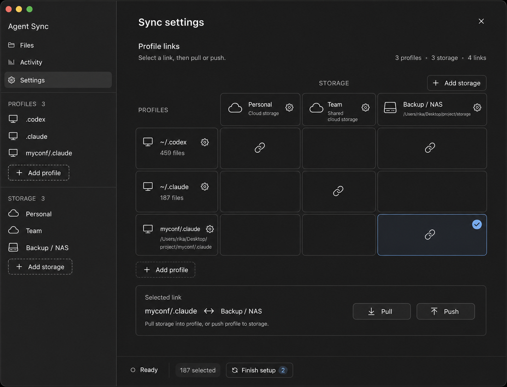

# Agent Sync

Tauri 2 desktop app for syncing local agent state such as `~/.codex` and
`~/.claude` to an S3-compatible bucket (AWS S3, Cloudflare R2) or a local
folder.

## UI concept



## Setup

Prerequisites: Node.js + npm, and a stable Rust toolchain + cargo (edition
2021). The Tauri CLI is a project devDependency — no global install needed.

```sh
npm install
npm run dev          # Vite frontend only, http://localhost:1420
npm run tauri dev    # full app: Rust backend + Vite frontend
```


There's no `.env` or checked-in config. On first launch, open Settings: add
one or more **storages** (a local folder, or an S3-compatible bucket —
bucket name, access key, secret, endpoint), then link **profiles** (local
agent roots like `~/.codex`, `~/.claude`, or extra ones at custom paths) to
storages in the matrix. Select a link to pull or push it. Everything is
saved to app data, not the repo.

## Design (basic)

Full spec: [`DESIGN2.md`](./DESIGN2.md) and
[`PLAN_MULTI_STORAGE.md`](./PLAN_MULTI_STORAGE.md). Short version:

- The settings matrix links N local **profiles** to N **storages**; each
  link syncs independently, with its own baseline keyed by
  (storage, cloud profile) — same-named profiles in two storages never
  share state. Per-file opt-ins are per storage.
- Each linked profile syncs as an independent cloud **profile**:
  `_head.json` (a small, CAS-protected pointer to the current
  generation), immutable `_manifests/`/`_commits/` history, and `_uploads/`
  object storage. Pull reads exactly what the head's manifest references —
  never a stray bucket object.
- Storage is abstracted behind a `Store` enum with two backends: S3-compatible
  (real sigv4 + conditional-PUT CAS) and local-folder (CAS via an flock'd
  `.lock` file, temp-file-then-rename writes).
- File state is a three-way comparison of local baseline (last synced), the
  cloud manifest, and the current filesystem scan. Push reconciles remote
  changes into a **union** before uploading instead of blocking: files
  changed on both sides get a deterministic conflict-copy sibling, unless the
  path has a merge driver (`history.jsonl`, `session_index.jsonl` dedup +
  sort instead). Deletions never propagate — pull restores a locally-deleted
  file.
- Which files sync by default is a tier allowlist, see
  [`AGENT_SYNC_FILE_SETS.md`](./AGENT_SYNC_FILE_SETS.md).

## Testing

Frontend has no committed test framework yet — `npm run build` (tsc) is the
frontend check. Rust gets `cargo check` plus the sync integration suite
below; add Rust unit tests near new backend logic as you go.

```sh
npm run build
cd src-tauri && cargo check
```

The sync integration suite lives in `src-tauri/src/sync_tests`. It runs
against local temp directories and a filesystem-backed stub S3 server, so it
does not need a real bucket, credentials, or external network access.

```sh
cd src-tauri
cargo test --lib sync_tests
```

From the repository root, use the manifest path instead:

```sh
cargo test --manifest-path src-tauri/Cargo.toml --lib sync_tests
```

Useful variants:

```sh
# Integration scenarios plus unit tests.
cargo test --lib
cargo test --manifest-path src-tauri/Cargo.toml --lib

# List integration tests.
cargo test --lib sync_tests -- --list
cargo test --manifest-path src-tauri/Cargo.toml --lib sync_tests -- --list

# Keep temp cloud/home dirs and print paths for debugging failures.
KEEP_SYNC_TEST_DIRS=1 cargo test --lib sync_tests -- --nocapture
KEEP_SYNC_TEST_DIRS=1 cargo test --manifest-path src-tauri/Cargo.toml --lib sync_tests -- --nocapture
```

The suite serializes itself internally because `$HOME` is process-global, so
you do not need to pass `--test-threads=1`. See
[`src-tauri/src/sync_tests/README.md`](./src-tauri/src/sync_tests/README.md)
for how the dual-backend harness (stub S3 + local store) works and what each
scenario (S1–S23) covers.

## Collaboration

Full guide: [`AGENTS.md`](./AGENTS.md). Highlights:

- React components in PascalCase (`SyncPanel.tsx`), camelCase variables/functions.
  Rust command payloads use snake_case fields to match serde output the
  frontend consumes as-is.
- Reuse the existing `invoke` command pattern for UI/backend calls instead of
  adding a state layer. Keep small functions near their callers.
- Keep comments for non-obvious behavior only — especially file filtering and
  sync safety decisions.
- Commits: concise and imperative (`Add sync config validation`). PRs: short
  problem statement, user-visible behavior changed, verification commands
  run, and a screenshot/recording for UI changes.
- Don't commit local secrets, tokens, generated bundles, or personal Codex
  data. Test destructive restore paths against disposable files or a
  backed-up `~/.codex` copy.
