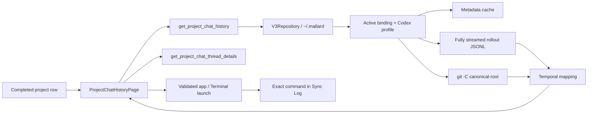

# Technical Design

## Data flow



## Backend contracts

`project_sync_v3::chat_history` contains scanning, parsing, Git discovery, temporal mapping, details, caching, and launch construction. Commands run blocking filesystem/process work off the async Tauri thread and are registered in both command handler lists.

```rust
get_project_chat_history(
    repository,
    local_project_id,
    branch,
    before_time,
    window_days,
    force_revalidate,
) -> ProjectChatHistory

get_project_chat_thread_details(
    repository,
    local_project_id,
    thread_id,
    cursor,
    limit,
) -> CodexThreadDetailsPage
```

The history response contains `codex_home`, window bounds, `next_before`, storage activity, thread summaries, optional Git history, uncommitted references, and technical warnings. The command emits warnings to Sync Log. Display name, alias, and directory presentation remain in existing project/binding DTOs.

`CodexThreadSummary` carries start/end/active state, branch and recorded SHA context, user rounds, agent messages, tool calls, maximum cumulative tokens, `metrics_complete`, and `commit_occurrence_count`. `CommitThreadReference` carries only a thread ID. `ThreadMatchKind` and confidence fields are removed.

## Full-stream parser and cache

The rollout parser uses `BufReader::read_until` and never retains the whole session. There is no 256-record, 16 MiB rollout, or 10,000-session stop. It retains only metadata and counters. A malformed or over-1-MiB individual JSONL record is skipped and marks metrics partial; later records are still read.

Timestamp priority is:

1. first and last valid timestamped records in the complete rollout;
2. session metadata timestamp;
3. session-index update time only for a partial session;
4. filesystem modification time.

`session_index.jsonl` supplies the preferred title. A malformed non-timestamp record never lets the index replace otherwise valid rollout endpoints. The local cache is `~/.mallard/chat_history_cache.json`; entries include canonical profile/path identity, file size, nanosecond mtime, and parsed metadata/metrics only. It is schema-versioned, size/entry bounded, symlink-safe, atomically replaced with mode `0600`, and stored below a mode-`0700` metadata root. Deleted rollout entries are pruned. Changed files miss the key and are fully reread. The Refresh button sends `force_revalidate=true`, bypasses hits, and rewrites validated entries.

## Mapping and 30-day windows

The scanner first filters sessions by `ended_at` into `[window_start, window_end)`. Git uses enumerated local branches, structured argv, first-parent/date-order logs, and a bounded 10,000-commit correlation rail. Session branch metadata prevents attaching a named session to a different branch.

All inclusive overlaps are attached. With none, the chronologically first commit no more than 24 hours after session end is used once. Otherwise the session is uncommitted. Commit references are sorted by session end descending, then start ascending, then thread ID. Unique session and reference counts are separate.

The response normally exposes commits in the requested 30-day window, plus any boundary commit carrying a selected session reference. Frontend page merging unions commit references by SHA/thread ID, recalculates occurrence counts, and prevents cross-window loss.

## Lazy details

Every detail request validates UUID, registered project, active binding, canonical project/profile paths, and rollout ownership. Duplicate IDs consistently select the complete rollout before the latest partial rollout for both summaries and details. The detail parser streams the winner and returns at most 50 genuine user/assistant previews from the cursor. User previews come only from filtered `event_msg.user_message`; agent previews accept visible `event_msg.agent_message` and assistant `response_item.message`, deduplicating paired copies. Injected tags and non-user roles, reasoning, system/developer messages, tool data, and raw payloads are excluded.

The frontend holds message pages once per thread ID and expansion state once per visual occurrence. Thus expanding one occurrence loads shared data without expanding every repeated card. Per-occurrence `aria-controls` IDs and keys use commit SHA plus thread ID.

## Storage timestamps

`RecipeBase` adds backward-compatible optional `last_pull_at` and `last_push_at`. Successful Push publish sets `last_push_at`; only an overall successful Pull apply sets `last_pull_at`, preserving the other timestamp. For older data, the latest complete matching materialization `applied_at` is the Pull fallback.

## Project-scoped launch security

Both actions revalidate ownership immediately before execution and log the exact command first.

- App: `/usr/bin/open -n -a /Applications/ChatGPT.app --env CODEX_HOME=<bound-home> codex://threads/<uuid>` using structured process arguments.
- Terminal: resolves an absolute Codex CLI, then opens Terminal with a shell-quoted `CODEX_HOME=<bound-home> <codex> resume <uuid> -C <canonical-project-root>` command.

UUIDs are strict, paths come from revalidated bindings, and user branch/cursor values never enter a shell. Missing app/CLI and OS launch failures return specific action errors.

## Frontend structure

`ProjectChatHistoryPage` owns branch/window loading, stale-request protection, merged pages, launch state, and lazy detail caches. `ProjectChatHistoryContent` is a pure renderer used by integration tests. Git renders Uncommitted Changes then newest-first commits; non-Git renders a flat newest-activity-first Codex thread list. Browser `content-visibility`/intrinsic sizing limits layout and paint work for rows outside the viewport when the rendered history exceeds 100 rows.

`list_project_repository_kinds` probes each active canonical binding with structured `git -C … rev-parse --is-inside-work-tree`. `ProjectSyncV3` joins the returned machine-local map into `LocalProjectSummary`, allowing the sidebar to render a static `Git Based`/`Non-Git Based` chip without scanning Codex history or persisting repository type in synchronized configuration. Unbound projects omit the indicator rather than being mislabeled.
