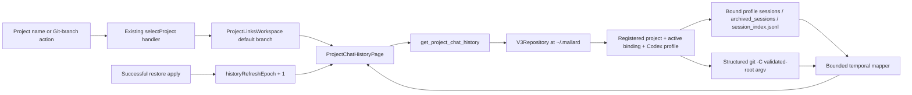

# Technical Design

## Component and data flow



## Backend module

`project_sync_v3::chat_history` owns this local-only feature instead of expanding the large command or capture modules. Its public entry points are:

```rust
get_project_chat_history(
    repository: &V3Repository,
    local_project_id: &LocalProjectId,
    branch: Option<&str>,
    before_commit: Option<&str>,
    limit: Option<usize>,
) -> Result<ProjectChatHistory, String>

open_codex_thread_in_terminal(
    repository: &V3Repository,
    local_project_id: &LocalProjectId,
    thread_id: &str,
) -> Result<(), String>
```

The Tauri wrappers move filesystem/Git/process work to `spawn_blocking`. They are registered in both the production handler and test keepalive lists.

The two feature commands in the approved interface are accompanied by a narrow `validate_codex_thread_ownership(local_project_id, thread_id)` launch guard. This avoids invoking full Git discovery/mapping before a desktop deep link while still enforcing the plan's requirement to revalidate ownership before every launch.

### Project/profile resolution

The module loads `sync_config.json` and `machine_projects.json` through `V3Repository`. It requires:

- an actual registered local project (not a setup draft),
- an active binding for the local project ID,
- a bound Codex provider profile,
- canonical project/profile paths that still match the persisted binding/catalog.

The scanner visits only `sessions/` and `archived_sessions/` under that profile and keeps only rollouts whose metadata `cwd` is the canonical project root or a descendant. Before Terminal launch, it repeats this ownership scan and requires an exact owned thread ID.

### Session parsing

- `session_index.jsonl` supplies the preferred title and update timestamp, supporting known field aliases.
- Each rollout read is capped by file size, line size, and line count. Malformed/non-UTF-8/oversized content becomes a partial warning rather than aborting all history.
- Rollout metadata supplies thread ID, cwd, start timestamp, Git branch, and recorded SHA.
- The first user message supplies a normalized, 180-character fallback summary.
- Index update time takes precedence for the end time; filesystem mtime is the fallback.
- A recently updated session can be marked active. End time is never allowed to precede start time.
- Titles/summaries remain in memory/response only and never enter capture descriptors or bundle manifests.

### Git access and pagination

All Git invocations use `Command` argv, beginning with `git -C <canonical project root>`. No user-provided value is interpolated into a shell command.

- Repository probe: `rev-parse --is-inside-work-tree`.
- Local branches: `for-each-ref refs/heads/` plus the symbolic current branch.
- Commit rail: `log --first-parent --date-order` with SHA, commit timestamp, and subject.
- The requested branch must be an enumerated local branch or a recorded-but-unavailable historical session branch.
- A recorded thread branch routes that thread to the matching rail. Missing branch metadata remains eligible for best-effort correlation; a different named branch is excluded rather than shown as an unmapped thread on the wrong branch.
- Commit cursors must be full 40- or 64-character hexadecimal object IDs and must occur on the selected branch's first-parent rail.
- Each response returns at most 50 commits. Correlation uses up to the newest 10,000 commits so paging does not reclassify a thread; truncation is returned as a warning.
- Non-Git directories return `git: null` instead of an error.

## DTO contract

```text
ProjectChatHistory
├── project_id
├── threads: CodexThreadSummary[]
├── git?: GitHistoryPage
│   ├── selected_branch
│   ├── branches: GitBranchSummary[]
│   ├── commits: GitCommitSummary[]
│   │   └── thread_refs: CommitThreadReference[]
│   ├── next_cursor
│   ├── unique_thread_count
│   └── reference_count
├── unmapped: UnmappedThreadReference[]
└── warnings: string[]
```

`ProjectChatHistory` intentionally does not repeat display name, path, or alias. The page receives the current `LocalProjectSummary` and uses `projectLabel(project)` for presentation.

## Frontend state boundaries

`ProjectChatHistoryPage` owns branch selection, page accumulation, loading states, partial/action errors, pagination, and a monotonically increasing request ID. Responses from a stale project/branch/refresh request are ignored. `ProjectLinksWorkspace` supplies only the active project/binding, settings callback, and refresh epoch.

The `ProjectChatHistoryContent` renderer has no Tauri dependency in its execution path, which permits server-rendered integration assertions for Git and non-Git output. Stable SHA/thread IDs are used as React list keys.

## Launch security

### Codex desktop

The frontend validates a standard UUID shape and constructs only `codex://threads/<thread-id>`. The Tauri opener capability adds only the `codex://threads/*` scope for this custom scheme. Failure explicitly directs the user to `Open in Terminal`.

### Terminal

Rust validates registration, binding, canonical roots, UUID shape, and rollout ownership before launch. On macOS, it resolves the Codex CLI through `/bin/zsh -lc 'command -v codex'` so the GUI app sees the user's login-shell Homebrew/npm path, then asks Terminal to run the resolved absolute executable:

```text
codex resume <quoted-thread-id> -C <quoted-canonical-project-root>
```

Shell single quotes and AppleScript string characters are escaped by tested helpers. Windows/Linux terminal automation remains unsupported and returns a specific error.
